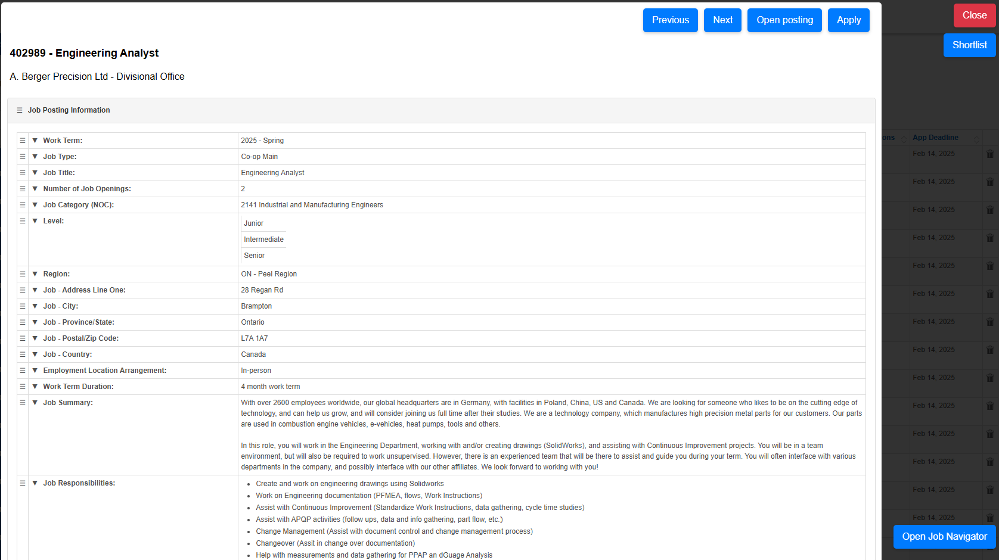

# Waterloo Works Job Navigator

## Overview

This Chrome extension enhances Waterloo Works job browsing by adding a **modal-based job navigator**, **keyboard shortcuts**, and **easy job application access**.

This is an improved version of the features found in **WaterlooWorks Azure**, but **better**. You can **collapse different sections, drag and drop them around**, and reorder job details so you can scroll through in the order you prefer.

## Features

✅ **Job Modal Viewer** – View job details in a **pop-up modal** without leaving the job list.\
✅ **Keyboard Shortcuts** – Navigate jobs using **WASD + Q** controls.\
✅ **Shortlist Toggle** – Quickly add or remove jobs from your shortlist.\
✅ **Customizable Layout** – Collapse and reorder job details as needed.\
✅ **Persistent Data** – Keeps track of favorite jobs and viewed job listings.

## 📥 Installation Guide

### **Step 1: Download the Extension Files**

1. Go to the **GitHub repository** (provide the actual repo link here).
2. **Click the green "Code" button**, then select **"Download ZIP"** to download the extension files.
3. **Extract** the ZIP file to a folder on your computer.

### **Step 2: Enable Developer Mode in Chrome**

1. Open **Google Chrome**.
2. In the address bar, type **`chrome://extensions/`** and press Enter.
3. In the **top-right corner**, turn on **Developer Mode**.

### **Step 3: Load the Extension**

1. Click **Load unpacked** (top-left).
2. Navigate to the folder where you extracted the extension.
3. Select the folder and **click OK**.
4. The extension should now appear in your list of installed extensions.

> **⚠️ I have submitted the extension for approval on the Chrome Web Store, but it takes a little while to get approved. Until then, this is the only way to use it.**

## 🎮 Navigation Commands (WASD + Q)

| Key     | Action                                                    |
| ------- | --------------------------------------------------------- |
| **A**   | View **Previous** job                                     |
| **D**   | View **Next** job                                         |
| **S**   | **Toggle Shortlist** (Adds or removes job from favorites) |
| **W**   | **Open Posting** in a **new tab**                         |
| **Q**   | **Apply** to the job                                      |
| **ESC** | **Close** the modal                                       |

## 🖱️ How to Use

1. **Open Waterloo Works** and go to the **Jobs Page**.
2. Click the **"Open Job Navigator"** button in the **bottom-right corner**.
3. Use **WASD + Q** to navigate between jobs in the modal.
4. Alternatively, **click the 🔍 magnifying glass** next to any job title to open it directly.
5. **Drag and drop sections** inside the modal to reorder job details in the way that makes the most sense to you.
6. **Collapse sections** you don’t need to keep things clean.

## 🎯 What It Should Look Like

## 🛠️ Troubleshooting

- **Can’t see the "Open Job Navigator" button?** Refresh the page.
- **Jobs not opening in the modal?** Ensure the extension is loaded correctly in **chrome://extensions/**.
- **Magnifying glass icon not showing?** Zoom out or adjust browser window size.
- **Shortlist not saving?** Try **clearing cache** or **reinstalling the extension**.

## 🏗️ Contributing & Feedback

If you run into any **errors or bugs**, please **open an issue** or let me know!\
If this extension **helped you**, please **star the repo** ⭐️ on GitHub!

---

## 📜 License

This project is open-source under the **MIT License**.

