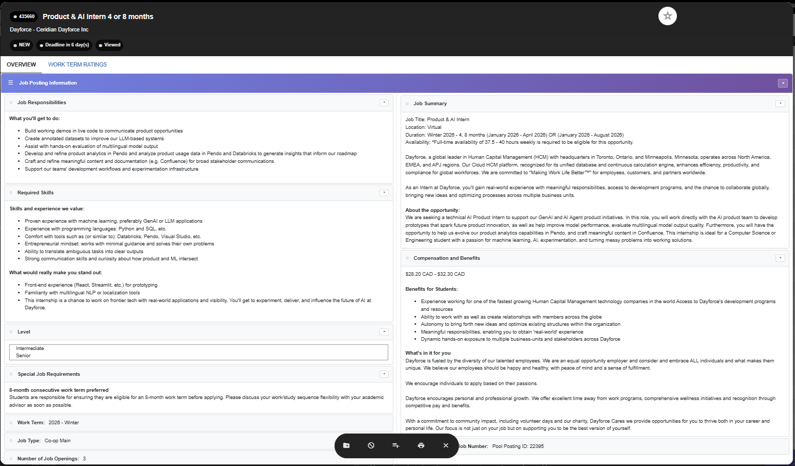

# WaterlooWorks Job Navigator (v15.1 - Restored Compact Layout)

An enhanced Chrome extension that adds keyboard navigation and UI improvements to WaterlooWorks job postings. **Now with instant loading - no more flash of unstyled content!**

## Features


### 🎯 Arrow Key Navigation
- **Left Arrow (←)**: Go to the **PREVIOUS** job posting
- **Right Arrow (→)**: Go to the **NEXT** job posting
- **Escape**: Close the modal
- Navigation wraps around (last job → first job and vice versa)

### 📋 Enhanced Modal UI
- **Reorderable Sections**: Drag and drop sections to reorder them
- **Collapsible Sections**: Click the arrow icon to collapse/expand sections
- **Persistent Preferences**: Your section order and collapsed states are saved
- **Consistent Experience**: Settings apply to all job postings

### 🎨 User Interface
- **Floating Button**: Purple button in bottom-right corner to open first job
- **Status Indicator**: Shows current position (e.g., "Job 3 of 25") in top-right
- **Clean Design**: Modern, intuitive interface with smooth animations

## What it should look like



## Installation

1. **Download/Clone this folder** to your computer

2. **Open Chrome** and navigate to:
   ```
   chrome://extensions/
   ```

3. **Enable Developer Mode** (toggle in the top-right corner)

4. **Remove any old version** if present

5. **Click "Load unpacked"**

6. **Select this folder** containing the extension files

7. The extension is now installed and active!

## How to Use

### Basic Navigation

1. **Go to WaterlooWorks** job search page:
   ```
   https://waterlooworks.uwaterloo.ca/myAccount/co-op/full/jobs.htm
   ```

2. **Click the purple button** in the bottom-right corner to open the first job
   - Or click any job title in the table

3. **Navigate with arrow keys**:
   - **Left Arrow (←)**: Previous job
   - **Right Arrow (→)**: Next job
   - **Escape**: Close the modal

### Customizing the Modal

When a job modal is open, you can:

1. **Reorder Sections**:
   - Click and drag the ☰ icon next to any section title
   - Drop it in your preferred position
   - Your order is saved automatically

2. **Collapse/Expand Sections**:
   - Click the ▼/▶ arrow on the right of each section
   - Collapsed state is remembered across all jobs

3. **Your preferences persist**:
   - Close and reopen jobs - your layout is preserved
   - Works across different browser sessions
   - Same layout applies to all job postings

## Customization Tips

- **Prioritize Important Info**: Drag sections like "Compensation" or "Required Skills" to the top
- **Hide Less Important Sections**: Collapse sections you rarely need to see
- **Create Your Ideal Layout**: Arrange sections in the order that makes most sense for your job search

## Troubleshooting

If the extension doesn't work:

1. **Refresh the page** (F5) after installing

2. **Check you're on the right page** - Must be on the WaterlooWorks job search results

3. **Clear localStorage** if you want to reset preferences:
   - Open DevTools (F12)
   - Go to Console
   - Type: `localStorage.removeItem('ww-navigator-prefs')`
   - Press Enter

4. **Check the console** for errors:
   - Press F12 → Console tab
   - Look for "WaterlooWorks Navigator" messages

5. **Reload the extension**:
   - Go to `chrome://extensions/`
   - Click the refresh icon on the extension

## Files

- `manifest.json` - Extension configuration
- `content.js` - Main logic (navigation, UI enhancements, drag-drop, persistence)
- `README.md` - This documentation

## Version History

- **3.0** - Major enhancement update
  - Added drag-and-drop section reordering
  - Added collapsible sections with persistence
  - Fixed arrow key directions (Left = Previous, Right = Next)
  - Improved modal enhancement system
  - Added localStorage for preferences
  - Added wrap-around navigation

## Privacy

This extension:
- Only runs on WaterlooWorks pages
- Stores preferences locally in your browser (localStorage)
- Does not send any data to external servers
- Does not track your activity